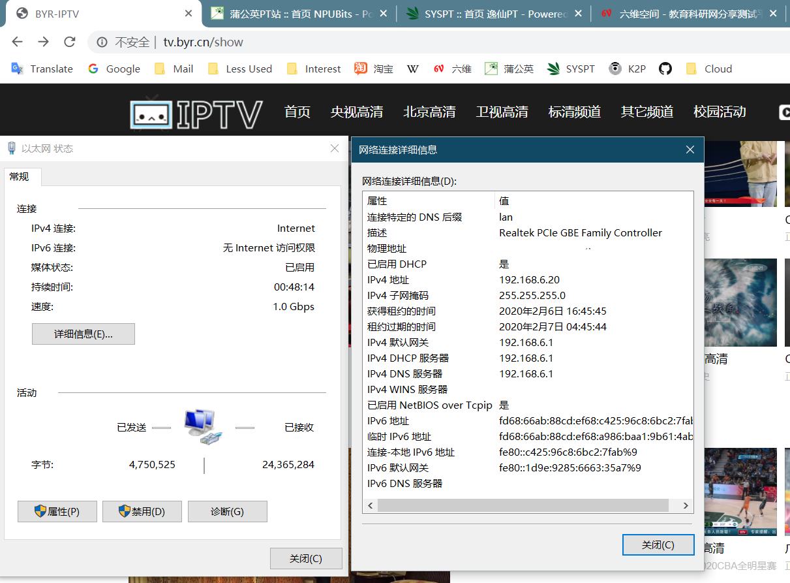

# 方案二：使用 SYSU OpenConnect VPN
## OpenWrt方案

由于我自己在认证阶段没有成功，所以仅提供一个思路。

---

1. 安装openconnect组件：
```bash
opkg update
# 默认已安装 dnsmasq-full ipv6-helper
opkg install openconnect luci-proto-openconnect
```
建议在编译固件时预编译以减少麻烦。

2. 在 `网络 - 接口` 中 添加一个新接口（例如： `ocvpn` ），协议选用 `openconnect` ，填入地址 `https://ocvpn.sysu.edu.cn` ，输入账号密码，点击提交。

3. 回到 `网络 - 接口` 后，如果接口 `ocvpn` 出现内网IPv4和公网IPv6地址即为成功。

4. `全局网络选项 - IPv6 ULA 前缀` 填写一个合适的网段。请参考：[如何选择IPv6网段](./How-to-choose-LAN-IPv6.md)

5. 修改`接口 - LAN - DHCP 服务器 - IPv6 设置` 的 `路由通告服务` 和 `DHCPv6 服务` 为 **`服务器模式` 或 `混合模式`**

6. 重启路由器

7. 检查IPv6网络状态
* [test ipv6](https://test-ipv6.com)
* [ipv6 test](https://ipv6-test.com)

