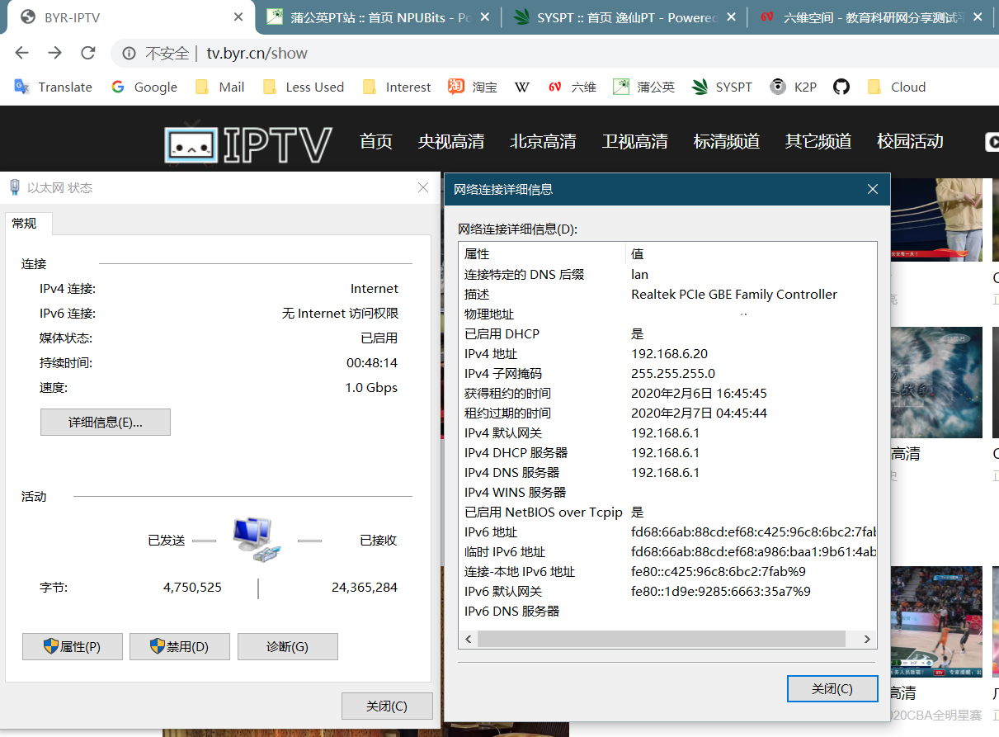

# 方案二：使用 SYSU OpenConnect VPN
## 服务器方案

前提条件：有一台Linux服务器。

这里以刷了[Armbian](https://www.armbian.com/)的[香橙派](http://www.orangepi.cn/OrangePiOneplus/index_cn.html)为例。
---
1. 安装必要软件
```bash
apt update
apt install openconnect radvd
```

2. 连接VPN
```bash
openconnect "https://ocvpn.sysu.edu.cn" -b
```
输入账号密码。

3. 设置IPv6转发及NAT
```bash
sudo echo "net.ipv6.conf.all.forwarding=1" >> /etc/sysctl.conf
sysctl -p
ip6tables -t nat -A POSTROUTING -o tun0 -j MASQUERADE  # Add to crontab
```

4. 设置IPv6路由广播
选择一个合适的网段，如`fd12:3456:7980:abcd::/64`。请参考：[如何选择IPv6网段](./How-to-choose-LAN-IPv6.md)
```
# /etc/radvd.conf
interface eth0 {
  AdvSendAdvert on;
  MinRtrAdvInterval 3;
  MaxRtrAdvInterval 10;
  prefix fd12:3456:7980:abcd::/64 {
    AdvOnLink on;
    AdvAutonomous on;
    AdvRouterAddr on;
  };
};
```
或者运行
```bash
echo "interface eth0 {" >> /etc/radvd.conf
echo "  AdvSendAdvert on;" >> /etc/radvd.conf
echo "  MinRtrAdvInterval 3;" >> /etc/radvd.conf
echo "  MaxRtrAdvInterval 10;" >> /etc/radvd.conf
echo "  prefix fd12:3456:7980:abcd::/64 {" >> /etc/radvd.conf
echo "    AdvOnLink on;" >> /etc/radvd.conf
echo "    AdvAutonomous on;" >> /etc/radvd.conf
echo "    AdvRouterAddr on;" >> /etc/radvd.conf
echo "  };" >> /etc/radvd.conf
echo "};" >> /etc/radvd.conf
```
随后
```bash
service radvd restart
```

5. 检查IPv6网络状态

